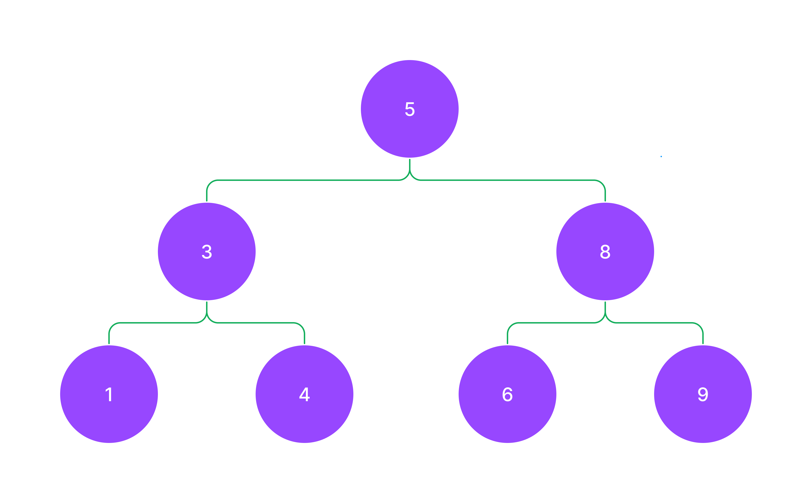

# 2.3 트리와 그래프

- 우리가 구현할 트리
  

```js
// 초벌작업
// 이진 트리의 기본형태
// value
// child - left
// child - right
const tree = {
  root: {
    data: 5,
    left: {
      data: 3,
      left: {
        data: 1,
        left: null,
        right: null,
      },
      right: {
        data: 4,
        left: null,
        right: null,
      },
    },
    right: {
      data: 8,
      left: {
        data: 6,
        left: null,
        right: null,
      },
      right: {
        data: 9,
        left: null,
        right: null,
      },
    },
  },
};
```

```js
class Node {
  constructor(data) {
    this.data = data;
    this.left = null;
    this.right = null;
  }
}
let node1 = new Node(5);
let node2 = new Node(3);
let node3 = new Node(8);
let node4 = new Node(1);
let node5 = new Node(4);
let node6 = new Node(6);
let node7 = new Node(9);

let root = node1;
node1.left = node2;
node1.right = node3;
node2.left = node4;
node2.right = node5;
node3.left = node6;
node3.right = node7;
```

```js
class Tree {
  constructor() {
    this.init = new Node(data);
    this.root = init;
    this.length = 0; // 노드 갯수
  }

  insert(data) {
    let newNode = new Node(data);
    let current = this.root;
    while (current) {
      // 내가 짜던 코드
    }
  }
}
```

<!-- 밑에 부터 수업  -->

```js
class Node {
  constructor(data) {
    this.data = data;
    this.left = null;
    this.right = null;
  }
}

class Tree {
  constructor(data) {
    this.init = new Node(data);
    this.root = this.init;
    this.length = 0; // 노드의 갯수
  }

  add(data) {
    let newNode = new Node(data);
    let current = this.root;
    while (current) {
      if (data == current.data) {
        // 들어온 값이 이미 존재하는 값이면 추가하지 않습니다.
        return;
      } else if (data < current.data) {
        // 왼쪽으로 이동해야 합니다.
        // 이동한 곳에 데이터가 비어있으면 데이터를 넣습니다.
        // 이동한 곳에 데이터가 있으면 계속 타고 내려갑니다.
        if (!current.left) {
          current.left = newNode;
          this.length++;
          return;
        }
        current = current.left;
      } else if (data > current.data) {
        // 오른쪽으로 이동해야 합니다.
        // 이동한 곳에 데이터가 비어있으면 데이터를 넣습니다.
        // 이동한 곳에 데이터가 있으면 계속 타고 내려갑니다.
        if (!current.right) {
          current.right = newNode;
          this.length++;
          return;
        }
        current = current.right;
      }
    }
  }

  // 깊스너큐
  DFS() {
    // 깊이우선탐색, DFS(Depth First Search)
    // Stack 이용

    let result = []; // 방문한 경로
    let stack = [this.root];

    while (stack.length !== 0) {
      let current = stack.pop();
      result.push(current.data);

      if (current.right) {
        stack.push(current.right);
      }
      if (current.left) {
        stack.push(current.left);
      }
    }
    return result;
  }

  BFS() {
    // 너비우선탐색, BFS(Breadth First Search)
    // Queue 이용

    let result = []; // 방문경로
    let queue = [this.root];

    while (stack.length !== 0) {
      let current = stack.shift();
      if (current.right) {
        stack.push(current.right);
      }
      if (current.left) {
        stack.push(current.left);
      }
      result.push(current.data);
    }

    return result;
  }
}
```
